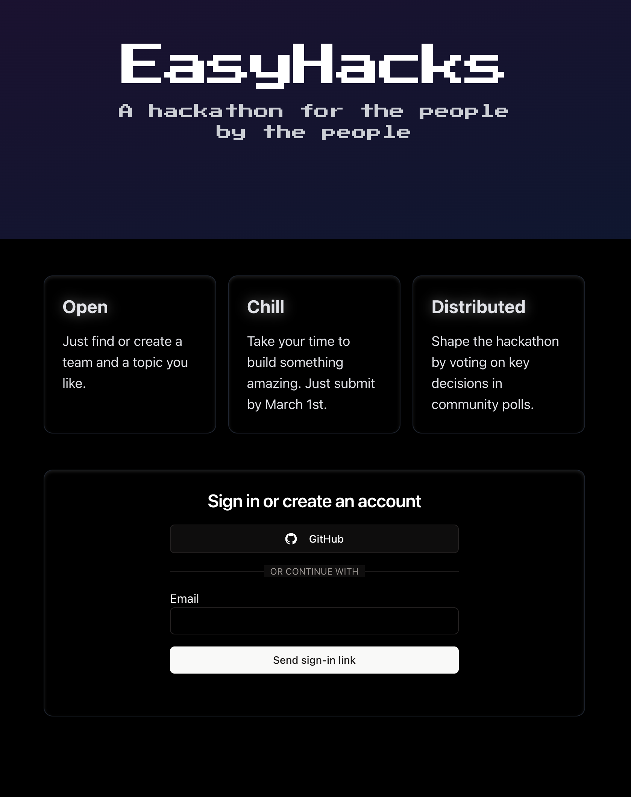
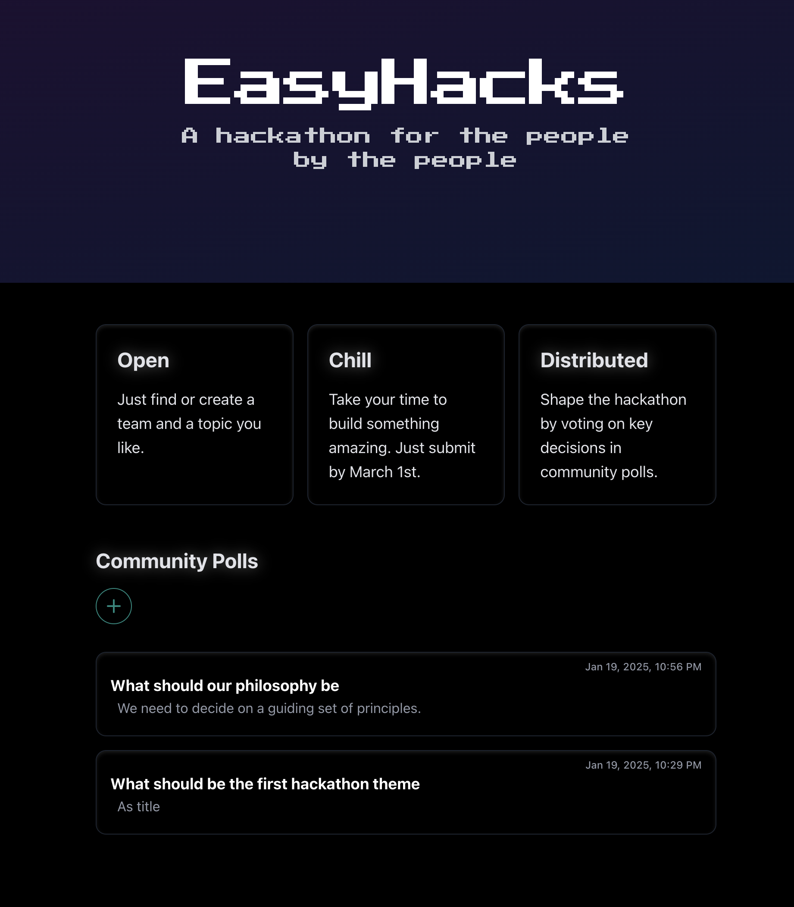
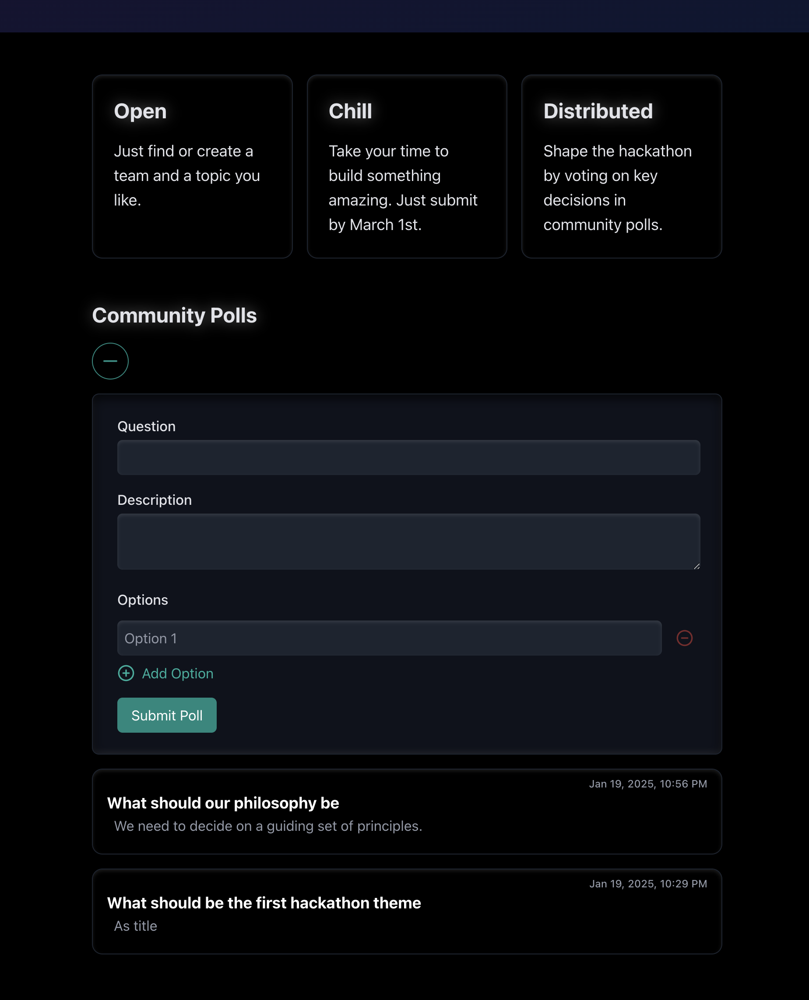
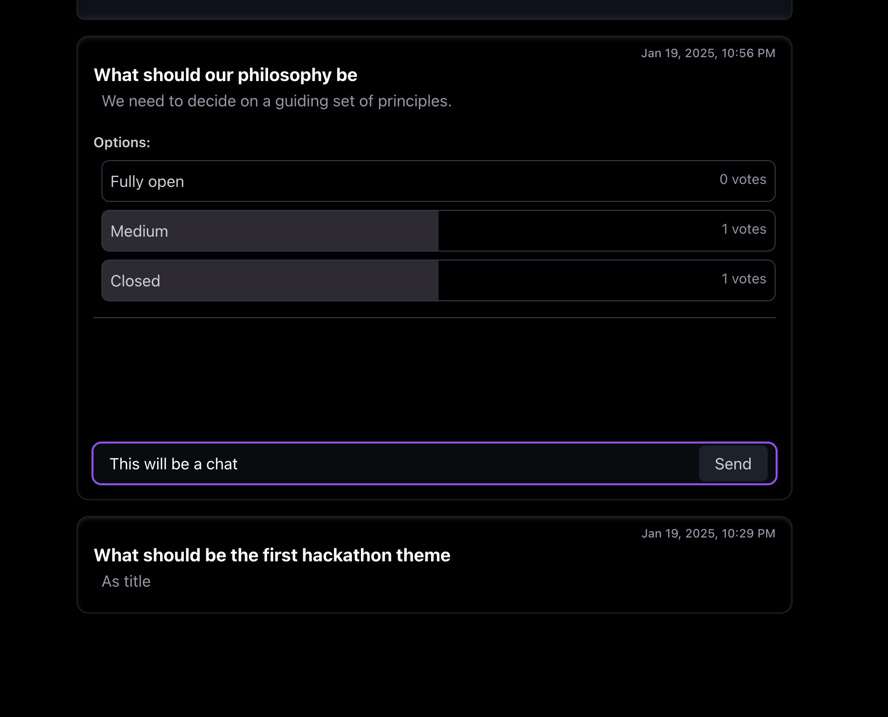

# Welcome to your Convex + Next.js + Convex Auth app

This is a [Convex](https://convex.dev/) project created with [`npm create convex`](https://www.npmjs.com/package/create-convex).

After the initial setup (<2 minutes) you'll have a working full-stack app using:

- Convex as your backend (database, server logic)
- [Convex Auth](https://labs.convex.dev/auth) for your authentication implementation
- [React](https://react.dev/) as your frontend (web page interactivity)
- [Next.js](https://nextjs.org/) for optimized web hosting and page routing
- [Tailwind](https://tailwindcss.com/) and [shadcn/ui](https://ui.shadcn.com/) for building great looking accessible UI fast

## Get started

If you just cloned this codebase and didn't use `npm create convex`, run:

```
npm install
npm run dev
```

If you're reading this README on GitHub and want to use this template, run:

```
npm create convex@latest -- -t nextjs-convexauth-shadcn
```

## The app

The app is a proposal project for running a community ran hackathon. To begin, it is a polling application where users can create polls, vote on options, and discuss topics through messages. Walkthrough of the source code:

- [convex/auth.ts](./convex/auth.ts) configures the available authentication methods
- [convex/polls.ts](./convex/polls.ts) handles poll creation, listing, and management
- [convex/votes.ts](./convex/votes.ts) manages voting functionality
- [convex/pollOptions.ts](./convex/pollOptions.ts) manages poll options
- [convex/pollMessages.ts](./convex/pollMessages.ts) handles messages related to polls
- [app/layout.tsx](./app/layout.tsx) is the main app layout
- [app/page.tsx](./app/page.tsx) is the main page of the application

## Configuring other authentication methods

To configure different authentication methods, see [Configuration](https://labs.convex.dev/auth/config) in the Convex Auth docs.

## Learn more

To learn more about developing your project with Convex, check out:

- The [Tour of Convex](https://docs.convex.dev/get-started) for a thorough introduction to Convex principles.
- The rest of [Convex docs](https://docs.convex.dev/) to learn about all Convex features.
- [Stack](https://stack.convex.dev/) for in-depth articles on advanced topics.

## Deploy on Vercel
I suggest using Vercel for deployment.

Check out  [Next.js deployment documentation](https://nextjs.org/docs/app/building-your-application/deploying) for more details.

- Join the [Convex Discord community](https://convex.dev/community) to get help in real-time. Use the ai-support channel to get help.
- Follow [Convex on GitHub](https://github.com/get-convex/), star and contribute to the open-source implementation of Convex.

## Demo

___

___

___

